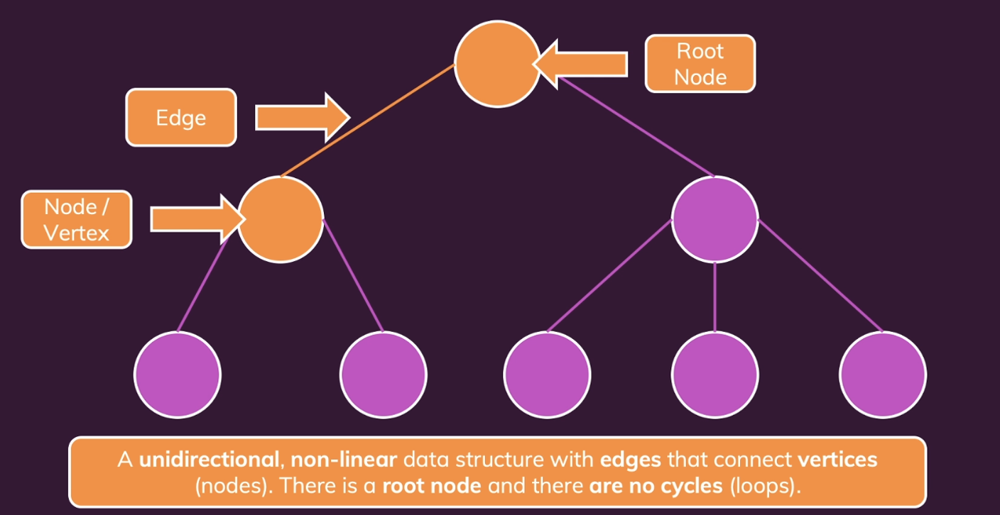
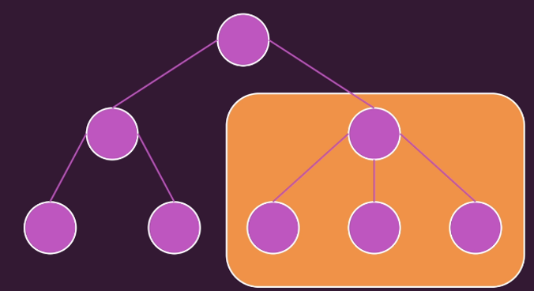
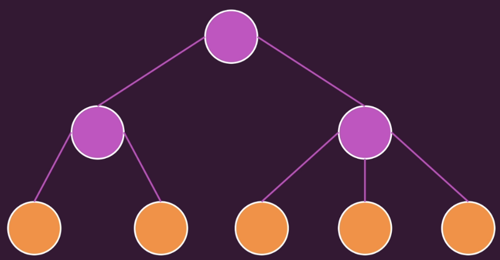
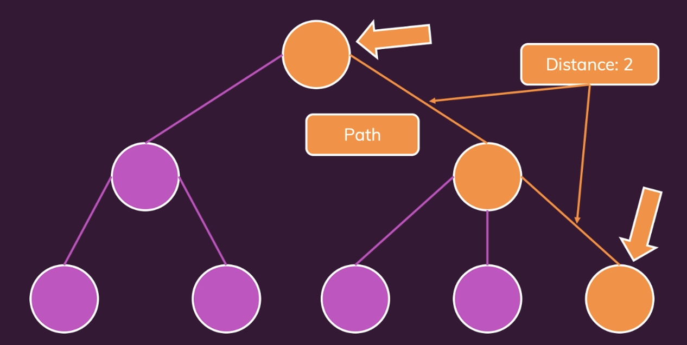
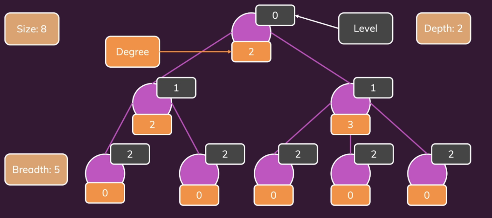

# Trees

## Introduction

A tree has a single root node. There are no cycles or loops.

## Terminology

### Node/Vertex

A structure that contains a value.

### Edge

The connection between 2 nodes.

### Root node

The topmost node in the tree.

### Sub tree

### Leaf

It’s a node without any child nodes (sub tree)

### Path and distance

#### Path

Sequence of nodes and edges that connects two nodes.

#### Distance

Number of edges between 2 nodes.

### Family

#### Parent/Child

Two directly connected nodes, parent is above child node.

#### Ancestor/Descendant

Two nodes that are connected by multiple parent child paths. The ancestor need not be the root node. It can be any node if it has children. And and child no matter how deep is descendant to the ancestor. So, parent/child is a example of ancestor/descendant

#### Sibling

Two nodes with the same parent.

## Other terminology

### Degree

Number of child nodes of a given node.

### Level

Distance between a node and a root node.

### Depth

Maximum level in a tree. This describes how much vertical space we need.

### Breadth

The number of leaves in a tree. This describes how broad the tree is. This describes how much horizontal space we need.

### Size

Total number of nodes in a tree.

