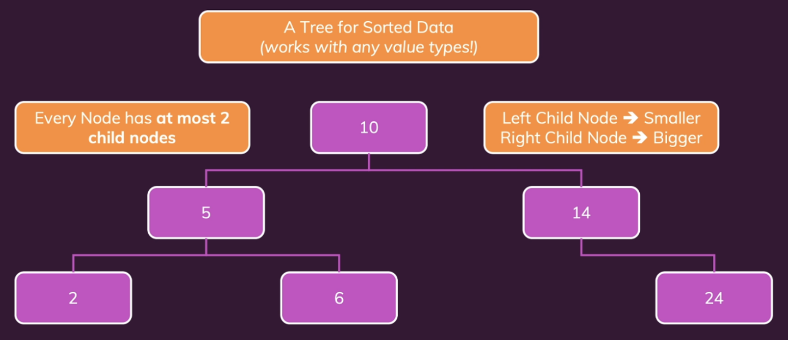
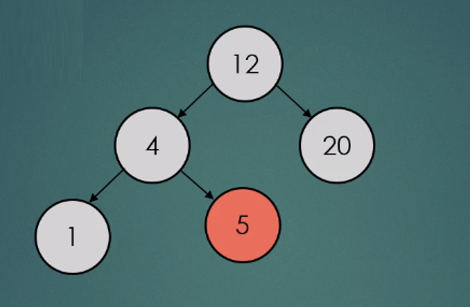
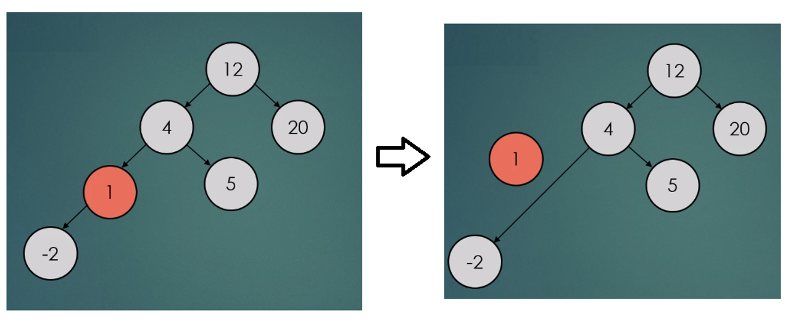

# Trees

## Introduction

A tree has a single root node. There are no cycles or loops.


## Terminology

### Node/Vertex

A structure that contains a value.

### Edge

The connection between 2 nodes.

### Root node

The topmost node in the tree.

### Sub tree


### Leaf

It’s a node without any child nodes (sub tree)


### Path and distance

#### Path

Sequence of nodes and edges that connects two nodes.

#### Distance

Number of edges between 2 nodes.


### Family

#### Parent/Child

Two directly connected nodes, parent is above child node.

#### Ancestor/Descendant

Two nodes that are connected by multiple parent child paths. The ancestor need not be the root node. It can be any node if it has children. And and child no matter how deep is descendant to the ancestor. So, parent/child is a example of ancestor/descendant

#### Sibling

Two nodes with the same parent.


## Other terminology

### Degree

Number of child nodes of a given node.

### Level

Distance between a node and a root node.

### Depth

Maximum level in a tree. This describes how much vertical space we need.

### Breadth

The number of leaves in a tree. This describes how broad the tree is. This describes how much horizontal space we need.

### Size

Total number of nodes in a tree.


# Binary search trees

## What is BST? (Binary search trees)

- Any node can have only 2 child nodes.
- Left node is smaller that parent and right node is larger than the parent.



## Tree traversal

### Depth-First Traversals (DFS)

These go deep into the tree before backtracking.

#### Inorder Traversal (Left → Root → Right)

- Most important for BSTs.
- Visits nodes in sorted (ascending) order.
- Get sorted elements from a BST.
- Validate if a tree is a BST.

#### Preorder Traversal (Root → Left → Right)

#### Postorder Traversal (Left → Right → Root)

### Breadth-First Traversal (BFS)

Visits nodes level by level.

```
Level 0 → root
Level 1 → children
Level 2 → grandchildren
```

## Deleting nodes

### If node is a leaf node

This is the simplest case. Since the node has no children, you can simply remove it from the tree by setting the pointer from its parent to `NULL`




### If the Node has one child

If the node has only one child (either left or right), you "bypass" the node. You connect the node's parent directly to the node's child, similar to removing a link in a linked list.




### If the Node has two children

When removing a node from a Binary Search Tree (BST) that has two children, the key idea is to replace the node with a value that preserves BST ordering.

If a node has two children, you cannot delete it directly.
Instead, you:

- Find a replacement node.
- Copy its value into the node to be deleted.
- Delete the replacement node (which will have at most one child).

There are two valid choices for the replacement:

#### Inorder Successor (most common)

- The smallest value in the right subtree.
- To find the smallest value, we go right once, then all the way left.

For example: If we were to remove 50. 

Right subtree → minimum value

Successor = 60

```
        50
       /  \
     30    70
    / \   / \
  20  40 60  80

```

The resultant tree looks as below:

```
        60
       /  \
     30    70
    / \     \
  20  40     80

```

#### Inorder Predecessor

The largest value in the left subtree

To find the largest value, we go left once, then all the way right.