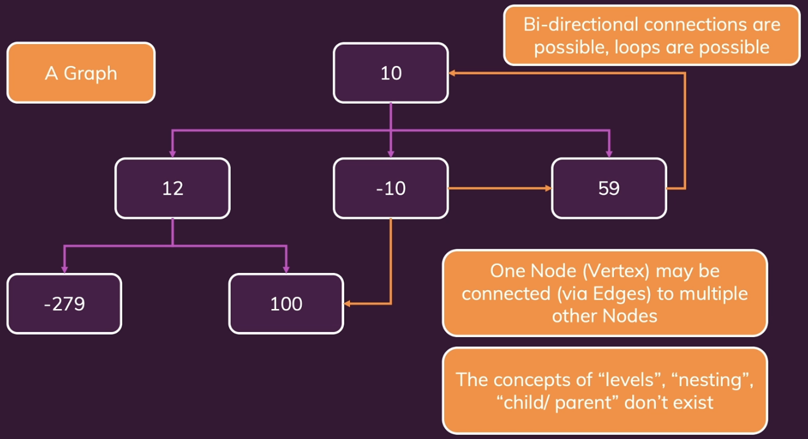
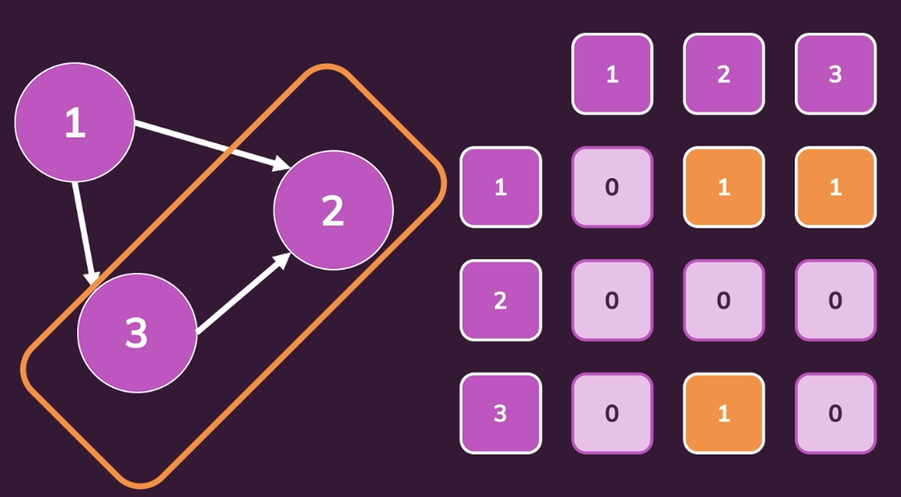
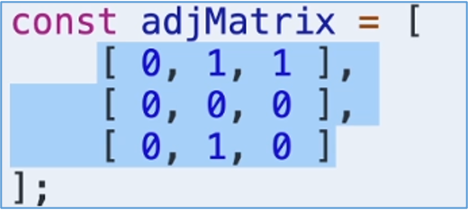
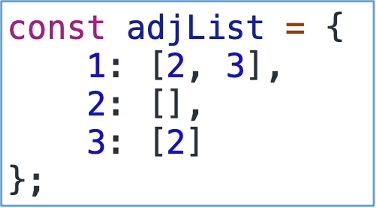

# GRAPHS

## Introduction

Unlike trees, graphs are not unidirectional. There is no concept of hierarchy/child-parent relationship etc.

## Types of graphs.

### Directed and undirected

-	Directed - Graphs with arrows. Uni-directional.
-	Undirected - Graphs without arrows. Bi-directional.

### Weighted and unweighted

- Weighted - Graphs with weights. These weights are called the code of edge and weight definition depends on what kind of graph are we looking at. 
- Unweighted - Graphs without weights.

### Connected and disconnected

- Connected - All nodes are connected with each other.
- Disconnected - Some nodes may be disconnected.

## Representing graph in code

### Adjacency matrix

Y-axis represent start of arrow and x-axis represent end of arrow. If there is a connection, we mark as 1 else 0.

In JS we represent as:

-	First array represents Node 1 pointing to other 3 nodes and so on. We can access as is.
-	In case of undirected graphs, we mark 1 for both directions. The matrix structure remains the same but the values in it changes.
- In case of weighted graphs, instead of 1, we mark with the weight of edge.

### Adjacency list

For the same above example, we write an adjacency list as below:

Key value represents an id of the node etc. And array is of node id’s again.

NOTE: Adjacency lists is a better alternative.

